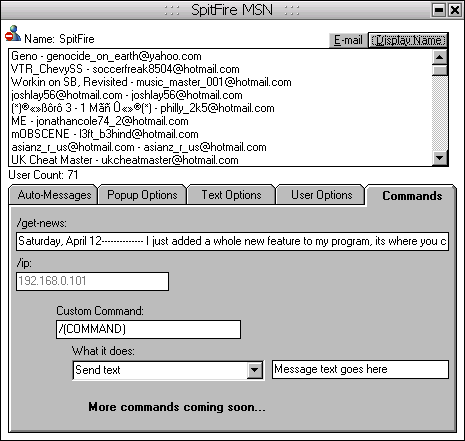



## SpitFire MSN

### Description

This is a MSN bot im writing which im trying to inlcude all the options of all the other bots out there and more. Its not finished yet, but im still working on it. For now this is ok I guess. Please rate! -**=--Update--=**- I have made an official homepage, http://spitfiremsn.tk . but i need a better host! So if anyone can help me out with that, it would be great!
 
### More Info
 

             |
---                |---
**Submitted On**   |2003-04-12 23:49:14
**By**             |[Jesse Seidel \(Dr\. Fire\)](https://github.com/Planet-Source-Code/PSCIndex/blob/master/ByAuthor/jesse-seidel-dr-fire.md)
**Level**          |Intermediate
**User Rating**    |4.9 (69 globes from 14 users)
**Compatibility**  |VB 6\.0
**Category**       |[Complete Applications](https://github.com/Planet-Source-Code/PSCIndex/blob/master/ByCategory/complete-applications__1-27.md)
**World**          |[Visual Basic](https://github.com/Planet-Source-Code/PSCIndex/blob/master/ByWorld/visual-basic.md)
**Archive File**   |[SpitFire\_M1572944132003\.zip](https://github.com/Planet-Source-Code/jesse-seidel-dr-fire-spitfire-msn__1-44707/archive/master.zip)

